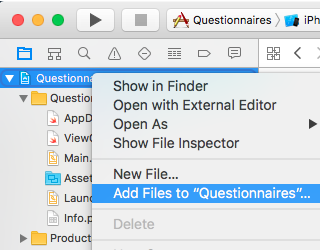
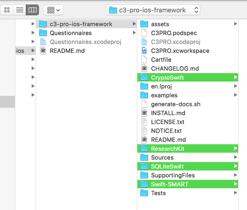
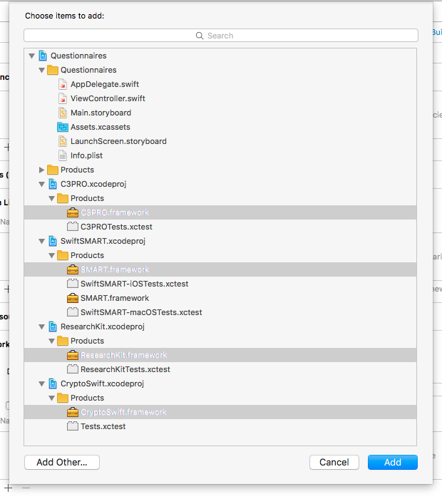
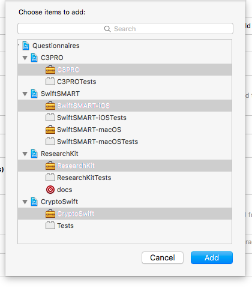

Installation
============

There are two ways to use the _C3-PRO_ iOS framework: install via _Carthage_ or a _manual_ install.


Carthage
--------

You can use [Carthage](https://github.com/Carthage/Carthage), a modern iOS framework manager, to use the C3-PRO iOS framework.
Put this in your `Cartfile`, then run `carthage update --platform "iOS"`:

```ogdl
github "C3-PRO/c3-pro-ios-framework.git" ~> 1.8
```

Check the matrix in the README to see which version you should be using.
Now, on your application targets’ “Build Phases” settings tab, click the “+” icon and choose “New Run Script Phase”.
Create a Run Script in which you specify your shell (ex: bin/sh), add the following contents to the script area below the shell:

```bash
/usr/local/bin/carthage copy-frameworks

$(SRCROOT)/Carthage/Build/iOS/C3PRO.framework
$(SRCROOT)/Carthage/Build/iOS/ResearchKit/ResearchKit.framework
$(SRCROOT)/Carthage/Build/iOS/Swift-SMART/SwiftSMART.framework
$(SRCROOT)/Carthage/Build/iOS/CryptoSwift/CryptoSwift.framework
$(SRCROOT)/Carthage/Build/iOS/SQLiteSwift/SQLite.framework
$(SRCROOT)/Carthage/Build/iOS/JSONWebToken.swift/JWT.framework
```

Make sure you drag & drop these frameworks into the “Embedded Binaries” in the “General” settings tab of your app the first time you set up Carthage.


Manual Installation
-------------------

Installing C3-PRO via git gives you most control but requires some fidgeting with Xcode.

#### 1. Add C3-PRO as Submodule

Add C3-PRO as a git [submodule](http://git-scm.com/docs/git-submodule) to your own project by running the following command:

```bash
$ git submodule add https://github.com/chb/c3-pro-ios-framework.git
```

#### 2. Add Files to Project

Open your Xcode project, select the blue top level project file, then at the bottom click <key>+</key> to add a new file to your project (or right-click your project file).



Select **all of the following project files** and make sure they appear nested in your own project hierarchy (doesn't matter whether at the top or bottom).

- `c3-pro-ios-framework/C3PRO.xcodeproj`
- `c3-pro-ios-framework/ResearchKit/ResearchKit.xcodeproj`
- `c3-pro-ios-framework/Swift-SMART/SwiftSMART.xcodeproj`
- `c3-pro-ios-framework/CryptoSwift/CryptoSwift.xcodeproj`
- `c3-pro-ios-framework/SQLiteSwift/SQLite.xcodeproj`
- `c3-pro-ios-framework/JSONWebToken/JWT.xcodeproj`



#### 3. Embed Libraries

With your blue project icon still active (in the Project Navigator), select the _“General”_ tab and scroll down to _“Embedded Libraries”_.
Click on the <key>+</key> button and add all of the following libraries:

- C3PRO.framework
- SMART.framework
- ResearchKit.framework
- CryptoSwift.framework
- SQLite.framework
- JWT.framework



#### 4. Add Target Dependencies

Add all embedded libraries to your _“Target Dependencies”_ so they get built whenever you build your app.
Still in the _“General”_ tab scroll up to _“Target Dependencies”_.
Click on the <key>+</key> button and add:

- C3PRO
- SwiftSMART-iOS
- ResearchKit
- CryptoSwift
- SQLite
- JWT



You should now be able to build and run your app.


CocoaPods
---------

Currently, [CocoaPods](http://cocoapods.org) cannot be used to install _C3-PRO_.

